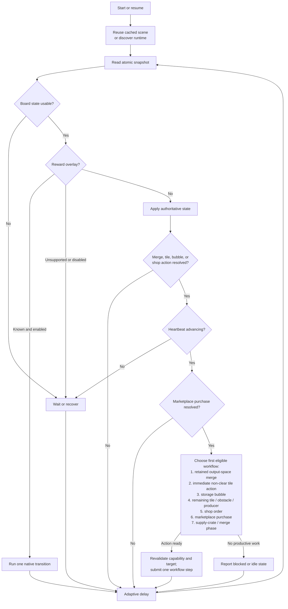

# Automation Methodology

The bot uses a persistent perceive → plan → internal action → verify loop. The
game's live cell map is authoritative. Snapshot reads, freeze protection, and
recovery are described in [Runtime Health and Recovery](runtime-health.md).

## Automation control flow

The diagram shows decision precedence, not a queue of actions. Each pass takes a
fresh snapshot, finishes verification of any submitted action, and then advances
at most one prioritized workflow step. Supply-crate batches are the exception at
this level: the runtime adapter still submits and verifies their individual claims
sequentially.

## Action rules

These rules apply to every workflow below.

- **Native paths only.** Actions call the game's own handlers, so the game
  keeps deducting costs, spawning rewards, running animations, and recording
  analytics. Physical mouse input is never used, even as a fallback.
- **Revalidation.** Immediately before submission, the runtime revalidates the
  scene, coordinate, object identity, blueprint, and the behaviors the action
  depends on. Each workflow adds its own checks, listed in its section. Any
  mismatch fails closed.
- **One action in flight.** A shared coordinator holds a single lease, so only
  one action of any kind (merge, tile interaction, crate, shop, marketplace,
  repair, expansion, visit, or event step) is pending at a time. Intent is recorded before dispatch, so a lost transport
  response is verified against a later snapshot instead of being resubmitted.
- **Authoritative confirmation.** An action stays pending while the heartbeat
  is frozen, the game reports its interaction handler busy, or the target
  reloads. Once the game is active, the bot waits for board state to settle and
  then records the intended result, a different board change, or an
  authoritative no-op.
- **Result codes.** Submissions return `submitted`, `busy`, `unavailable`,
  `rejected`, `stale-source`, `invalid-target`, or `invalid-destination`.
- **Per-target retries.** Retry state is keyed by target, so other eligible work
  proceeds while a failed target cools down. A target the game reports busy is
  deferred briefly, and a warning is logged if it stays busy for two minutes
  (typically because the game tab is in the background and its animations are
  paused).
- **No-progress recovery.** Three consecutive submitted actions without
  authoritative progress request runtime recovery, whichever workflow submitted
  them.
- **Idle reporting.** When nothing can be planned, the idle diagnostic names the
  specific blocker when one exists, such as the focused obstacle's missing
  energy or workers, or a reward container's missing key objects.

## Runtime acquisition

CDP recognizes registered Farm Merge Valley integrations and walks each game
iframe's parent chain to its owning top-level page. Target pairs are cached and
rediscovered after a reload. Platform builds share one runtime contract;
optional features that a platform omits stay blocked by runtime capability
checks.

Integration definitions centralize the default page URL, trusted HTTPS page
hosts, game-frame matcher, support level, and startup strategy. A user may
override the page URL only within the selected integration's trusted host, which
changes the startup location without broadening target recognition. Browser
startup and session maintenance share one lifecycle dispatcher, so
integration-specific branches stay out of the orchestration loops. A new
integration should be registered only after its target ancestry and runtime
contract are validated.

On acquisition, the bot applies each supported focus-emulation,
unlocked/user-active, and active-lifecycle override once per browser target;
unsupported optional overrides are logged once at DEBUG. The managed browser is
also launched with Chromium's background-throttling switches
(`--disable-background-timer-throttling`, `--disable-renderer-backgrounding`,
and `--disable-backgrounding-occluded-windows`).

The runtime adapter locates and validates the active gameplay screen, board map,
tile-interaction handler, shop-order service, HUD crate event, and supply
inventory. References are retained in the page only while their scene identity
remains current, and a game update that breaks discovery fails closed with
structured diagnostics.

Observation mode runs discovery, snapshots, and sanitized diagnostics, but a
runtime-level gate rejects every action before its JavaScript is evaluated.
Integrations may still perform bounded page-level session maintenance that does
not call the game runtime.

## Overlays

A default-enabled overlay step runs before the heartbeat gate. It closes known
overlays through their native callbacks, one transition per loop iteration:

- level-up, daily bonus, daily challenge, timed-event, ordinary reward,
  travel-summary, like-claim, building-upgrade, and promotional popups;
- sticker album and set transitions, and sticker packs through their native
  Skip and then Collect transitions;
- optional high-rank duplicate raffle proposals, declined through their "Not
  now" interaction once the animation resolver is ready. A proposal left
  partially closed by an interrupted transition is completed before pack
  collection continues;
- the push-notification opt-in popup, through its native dismiss handler, which
  keeps the game's dismissal timestamp without requesting notification
  permission.

Intermediate sticker animation states block board actions until Collect is
available. Sticker pack state is read from its dedicated top-level navigation
view rather than the gameplay popup layers.

Some popup-layer elements are ignored because they do not block play:

- toast notifications, identified structurally rather than by their
  build-specific class name, so a queued toast cannot hide a supported popup;
- explicitly non-interactive, non-dismissible elements;
- fully transparent effects left behind when a collect animation is interrupted
  (for example by a renderer stall).

One-shot overlay actions share a per-instance submission guard, so a popup that
stays visible while closing is not dismissed twice. The game's disconnection
layer and session-replacement notice request recovery instead of being
dismissed. Shops, settings, missions, confirmations, navigation screens, and
unknown interactive popups are never closed; they pause automation, and a
warning is logged if one blocks automation for two minutes.

## Tile interactions and producers

The live cell read includes semantic behaviors as well as blueprint identity.
Catalog metadata assigns each object an interaction mode (see
[Item Catalog](item-catalog.md#interaction-modes)), and the object's tier
policy must have Interact enabled. Ingredients, train tickets, ordinary supply
crates, reward containers, crops, animals, obstacles, and upgrade-card tiers 1
and 3 default on; coins, energy, gems, and newly discovered direct-interaction
types default off.

The interaction phase handles direct board tiles first, then affordable
obstacle stages, then retires depleted producers, and finally harvests ready
producers. Interactions use the active tile handler's internal object-click
pipeline. A direct interaction is confirmed when the source object leaves. A
click with neither a source transition nor expected output is a genuine no-op.

**Currency rewards** (coins, energy, gems) call the same `_collectReward` handler
as the item's Claim button, after also checking the currency and collectable
behaviors and non-empty reward data. The confirmation popout is not created.

**Storage bubbles** are detached from the board, so they use their own reader
and action path. The default-enabled toggle pops a bubble only when the board
has an empty cell, after revalidating the bubble's identity, contents, and the
current board space. The game can release a multi-item bubble partially; removal
of the bubble or a smaller content list confirms progress, and the remaining
contents are retried when space is available.

**Reward containers** (Reward Chests, Stickerbook crates, event crates, and
other `crateReward` containers) expose an Open policy. Their live reward list
sets an exact board-space requirement, and unlike producer output they cannot be
claimed partially, so merge work continues until the full capacity is available.
The snapshot carries each container's unlock requirements and the game's
`hasEnoughItems` result; keyed containers are skipped until every required
object is present. Before opening, the runtime also revalidates the chest and
cooldown behaviors and every key object, then uses the game's chest-opening
pipeline.

**Upgrade cards** carry their crop or animal target, and the snapshot reads that
target's highest applied tier from the game's upgrade model. An enabled card is
eligible only when its tier is higher, which is rechecked immediately before
calling the upgrade service. Source replacement or tier advancement confirms
the action. After one duplicate card applies, the remaining copies are excluded
but stay available to normal merge policy.

**Tier-4 producers** are ready when harvestable without an active `cooldown` or
`depleted` behavior, cooling while `cooldown` is present, and ready to retire
when depleted. The visual `cooldownPreview` behavior is ignored because it
persists after the second harvest's timer completes. Depleted animals convert in
place; depleted crops need one open cell for their two tier-1 replacements.

A ready producer's open-cell target comes from the maximum output count in its
live reward metadata, falling back to the configured count (four by default).
If the target is not met, merge work preempts interaction and supply crates, and
the space request is retained until it is met or no productive merge remains;
the producer then claims into whatever space is available. Harvesting is
complete after a producer lifecycle transition, and partially complete when an
expected reward appears while the producer stays ready. Partial progress lowers
the remembered output count and reschedules the same source without a warning or
cooldown. Retirement is confirmed when the producer is replaced.

## Obstacles

Obstacle clearing reads the energy balance, total and available workers, and
each source's hit points, stage count, current energy and worker cost, mobility,
and paid or clearing state. Only one obstacle is focused at a time. Fixed
obstacles come before movable ones. The configured `obstacle_priority_focus`
then chooses the first rule, and the other rules break ties in this order:

1. already started;
2. lower tier;
3. nearer completion;
4. lower on the board (largest row).

Board coordinate is the final tiebreaker.

All paid stages exposing `lootable` output are claimed through the normal tile
pipeline before another stage starts, and each obstacle's loot list supplies its
space target and expected reward IDs. The global obstacle-spending control stops
new stages from being paid without blocking loot from a stage already paid.
While no worker is available, the focus stays unchanged; after loot is claimed,
the focused obstacle gets a brief settle window before a worker may start a
different one. An unaffordable focused obstacle that is not clearing still
waits rather than falling through to a lower-priority one.

A paid obstacle without a fresh resource gate is not charged again and does not
block a worker from starting the next eligible obstacle. The paid marker can
persist after loot is collected; with a fresh resource gate present, the obstacle
is ready for its next stage.

Clearing calls the game's resource-gate payment handler after also revalidating
the obstacle behaviors, stage cost, live energy, and worker availability. The
game deducts energy, reserves a worker, runs the timer, spawns rewards, and
removes the finished obstacle. An obstacle-state or object-identity change
confirms the submission.

## Building repairs

When building-resource preservation is enabled, one repair target is chosen
from placed, inactive, non-event buildings. Workshops come first, then other
structures, then decorative buildings; within a class, the lowest remaining
tier-weighted material cost wins. Materials for the target are reserved from
merges and policy-authorized removals.

The optional repair-material priority narrows obstacle selection to trees,
rocks, or toolboxes (any size) that produce a material the target still needs.
Focus is kept among matching obstacles but is replaced if the target changes and
the focused obstacle no longer supplies a needed material.

Once every requirement is on the board, the repair runs as an atomic,
highest-priority main-farm action through the game's resource-consumption
handler. The runtime revalidates the building level, exact cost, placed object,
matching repair popout, and board availability first, and a later snapshot
confirms the building is active.

## Supply crates

Supply-crate claiming has a default-enabled global control. The claim limit is
the lesser of the available inventory and the empty cells beyond the configured
merge-space reserve. The bot fires the HUD's crate event sequentially, resolving
the crate item from the active scene's inventory service each time rather than
trusting an object from an earlier scene. Each claim waits for an inventory or
board change before the next one, so zero inventory, zero space, delayed
updates, and partial completion are reported exactly. A short randomized delay
between claims matches normal rapid-click cadence without concurrent
submissions.

## Farm visits

Farm visiting is an optional runtime capability. It is disabled by default
because it spends train tickets, and platforms without the feature never expose
it. When enabled, it runs after higher-priority local work has nothing to submit
and before HUD supply crates are opened, spending held tickets before crates can
drop more and leaving room under the three-ticket cap.

The workflow opens the live train system, waits for an eligible destination, and
enters through the game's connection and scene-transition path, which preserves
the local farm snapshot. On the visited farm, normal automation is off; the
runtime reads only objects with the transient `visitorAction` behavior and
submits them one at a time through the visitor-action system, confirming each
by removal of that behavior. When no actions remain, the workflow returns home
through the native friend-farm transition service, or through the live return
signal on builds that hide that service, and waits for a fresh local scene.
Disabling the setting during a visit still lets the return complete. Expected
transitions get a short grace period before board discovery runs, and the
travel-summary reward popup is closed through the normal overlay path.

On the player's own farm, visitor-assisted tiles carry the `friendReward`
behavior and may hold rewards from several visitors. The default-enabled
visitor-reward setting claims one marked tile at a time through the native tile
handler, confirmed when that behavior disappears. The likes billboard uses its
own native claim handler and is eligible under the same setting only when the
live like count is positive and the unclaimed-likes popout is attached to that
billboard; removal of the popout confirms the claim.

## Event islands

Event automation is disabled by default. It has a master switch, a default for
newly discovered events, and per-event overrides. The workflow dismisses an
enabled event's introduction, enters the island, submits Explore actions and
normal board automation there, and returns to the main farm. Each step waits up
to 30 seconds for the event scene to confirm it, and an unconfirmed step cools
down before it is retried. An unsupported event runtime or a disabled current
event pauses automation rather than being navigated.

The bot enters an island only when the main farm has no other work and the event
exposes a live launcher or active event service. Entry needs event energy at the
configured threshold (50 by default). A freshly loaded game page keeps showing
its saved event energy and does not regenerate it until the island is opened, so
the energy check visit (every 60 minutes by default, 0 to disable) also enters
below the threshold when the island has not been visited since the bot started
or within that interval. When event reward claiming is enabled, free and
purchased track rewards are claimed on the main farm, outside scene transitions.

## Shop orders

The runtime reads current orders from the game's order service without opening
shop UI. Each order has stable shop and recipe IDs, its state, ingredient
requirements and live inventory amounts, duration and remaining timer, and exact
reward objects.

Shop and recipe policies each have a global default (both enabled) and per-ID
overrides, so new content is automated without a hardcoded list and individual
entries can still be disabled. A master switch pauses shop automation while
keeping those selections. Completing enabled orders takes priority over starting
new ones. Claims need one open cell per reward object; when space is short,
merge planning preempts the claim and supply crates.

Starting uses the game's public order handler, which checks the recipe and
affordability before deducting ingredients. The public reward method pans the
camera, so claiming instead validates the exact order, board capacity, and live
reward subscriber, then fires the order reward signal and the discovery and
action-bus events that analytics and daily-challenge progress depend on. If a
progression hook is missing, the claim fails closed. Each submission stays
pending until order state confirms the transition.

## Land expansion

Expansion automation and both per-purchase currency ceilings default to disabled
or zero. The snapshot reads every currently unlockable standard and premium area
from the game's map-area services, since several can be unlockable at once.
Each candidate includes its area ID, cell count, level and currency
requirements, the service's affordability result, and its southernmost board
row. Standard areas need an allowed coin cost and premium areas an allowed
crystal cost.

Planning prefers the cheapest eligible standard area. When only premium areas
are eligible, it picks the one furthest south (largest row), since the game gives
no other priority among them. Before submission, the runtime also revalidates
the area's state and requirements, the native affordability check, the live
balance, and the configured post-purchase reserve; missing or stale balance data
fails closed. The game's native unlock handler then deducts the cost and emits
progression events. A lost response stays single-flight until a later snapshot
shows whether the area is still locked.

## Marketplace purchases

Marketplace state is read while the master switch and at least one offer policy
are enabled, or while a purchase is pending. The catalog keys each flash
candidate by slot and candidate, and each genuine free claim by offer. Flash
purchases default off and free claims default on; per-offer overrides take
precedence, and the master switch preserves those selections.

Planning considers only enabled entries whose live identity, reward, payment,
price, and stock still match, chooses deterministically, checks affordability,
and buys one unit. The purchase stays pending until a later snapshot shows the
expected stock decrease and, for paid offers, the exact balance decrease. A
timeout or lost response is treated as ambiguous and enters a bounded cooldown.

## Item removal

Removal is authorized only by an item's `always_remove` policy on items with the
game's `shovelable` capability, and `keep_minimum` limits it to excess copies.
Building-repair requirements can raise that minimum. The runtime prefers an
eligible interaction on the same tile and removes an item only when no
interaction is eligible; an obstacle that is already clearing is never removed.
After also checking the capability and remaining count, the runtime calls the
same callback as the game's confirmation dialog and confirms the board change.
The bot never removes an item as an emergency measure.

## Merge planning and submission

Board recognition uses the versioned [item catalog](item-catalog.md), so merge
capability comes from the game's merge graph rather than names or numeric
suffixes. User policy is keyed separately by family, which lets the GUI toggle
families, choose merge-5 behavior, and authorize removals without changing
recognition.

The coordinate-based planner prioritizes trigger, degroup, and gather actions,
prefers exact merge-5 work, excludes the highest known tier, and keeps the
empty-cell reserve while productive work exists. When both merge sizes can
trigger for the same item, merge-5 wins, although an immediate emergency merge-3
can still precede merge-5 gathering moves. Merge-3 is otherwise used only for
explicit per-item policy or the deadlock fallback, which applies whenever a
pending action needs more open cells than are available, up to the configured
maximum item tier (0 disables it).

Occupied-item swaps can recover a full board. The game may move the displaced
item to any empty cell rather than swapping literally, so success means the
dragged item reached its destination, and the next board read locates the
displaced item. When no policy-compliant merge can create required space, the
bot enters a non-terminal blocked state and keeps polling for a manual board
change or policy update.

Source and destination coordinates are resolved against the full live board
map, including cells that are off screen. The adapter checks for a movable source
and valid destination, projects the destination to a point inside the tile, and
confirms that the screen-to-grid round trip resolves to the exact cell. It then
uses the game's pick, drag, and drop pipeline, sending drag and drop straight to
the item handler so map-pan subscribers cannot move the camera mid-action. The
game decides whether the result is a move, swap, merge, or rejection. Item
actions are separated by a configurable randomized delay.

### Force-lucky merges

`force_lucky_merge` is a default-off per-item and per-tier policy for mergeable
items. It overrides the merge-5 preference and retries exact three-item merges
while the managed game is offline until at least two next-tier items appear.
These actions run after ordinary merges but remain eligible for urgent space
recovery, and retries also apply to emergency merge-3. A connected group larger
than three is first split with a safe move or swap; larger clusters are not
treated as lucky-merge candidates.

Before any merge is sent, isolation blocks new game requests and closes the
game's backend socket. A normal result is discarded by reloading the last saved
board, reopening the game through the portal launcher when needed; pausing or
stopping discards the current attempt. If isolation, the merge result, or
persistence cannot be verified, automation pauses rather than saving an
uncertain result. System Wi-Fi settings are never changed.

## Operational boundaries

The managed browser must stay open while automation runs; it may be unfocused,
occluded, on another virtual desktop, or showing another tab, but minimized and
headless operation are unsupported. Background flags reduce throttling but
cannot prevent network or server-side interruptions. Runtime health reads the
game's own connection state and hanging-ping threshold, and automation pauses
before submitting actions while the connection is down. Global pause and quit
hotkeys and Ctrl+C stay available throughout.

With automatic browser launch enabled (the default), starting automation ensures
the managed browser is running, opens the configured game page if it is missing,
and runs the integration's startup strategy until the game iframe appears or the
20-second startup timeout expires. Direct integrations need no host-page action;
Reddit may need Play to be pressed.

Future work and known constraints are tracked in [Open Items](open-items.md).
