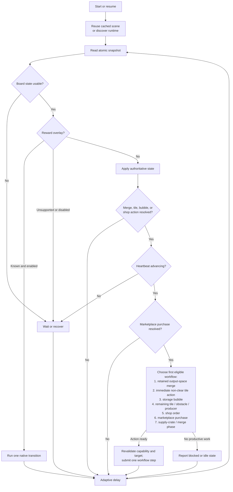

# Automation Methodology

The bot uses a persistent perceive → plan → internal action → verify loop. The
game's live cell map is authoritative.

## Automation control flow

The diagram shows decision precedence, not a queue of actions. Each pass takes a
fresh snapshot, finishes verification of any submitted action, and then advances
at most one prioritized workflow step. Supply-crate batches are the exception at
this level: the runtime adapter still submits and verifies their individual claims
sequentially.

The shared action coordinator permits only one merge, tile interaction, storage
bubble, shop, or marketplace operation to be in flight. A transport loss does
not clear that intent: after reconnection, the next authoritative snapshot is
used to confirm the result before another submission is allowed.

## Runtime acquisition

CDP recognizes registered Farm Merge Valley integrations and walks each iframe's
parent chain to its owning top-level page. Target pairs are cached and
rediscovered after a reload. Platform builds share a runtime contract, while
unavailable optional features remain blocked by runtime capability checks.
Observation mode can apply browser
lifecycle overrides and run discovery, snapshots, and sanitized diagnostics,
but a runtime-level gate rejects every action submission before its JavaScript
is evaluated. Integrations may also perform bounded page-level session
maintenance that does not call the game runtime. On acquisition, the bot
applies each supported focus-emulation, unlocked/user-active, and
active-lifecycle override once per browser target. Unsupported optional
overrides are logged once at debug level. The managed browser must also be
launched with the background-throttling switches
documented in the README.

Integration definitions centralize the default page URL, trusted HTTPS page hosts,
game-frame matcher, support level, and startup strategy. A user may override the
page URL only within the selected integration's trusted host; this changes the
startup location without broadening target recognition. Browser startup and
runtime session maintenance use a shared lifecycle dispatcher, keeping
integration-specific branches out of their orchestration loops. A new
integration should be registered there only after its trusted target ancestry
and runtime contract are validated.

Pause/resume uses a fast health check against the cached scene. The cache is
accepted only when the active map-grid service still owns the same board map
and the interaction handlers remain subscribed to that service; otherwise the
adapter performs fresh discovery.

Each browser target has one serialized, persistent CDP session. An active
iteration reads one atomic snapshot containing health, heartbeat, board state,
and only the optional feature data currently needed. Ordinary commands have a
short deadline; the explicitly requested heap query receives a longer bounded
deadline. Local DevTools WebSockets bypass proxy discovery. Browser `localhost`
endpoints are normalized to the numeric IPv4 loopback to avoid slow Windows
hostname and proxy resolution.
Pause and quit are checked while waiting for a response, and a timed-out or
stale connection is closed. Snapshot timeouts, JavaScript failures, heap scans,
and actions are not immediately replayed. Temporary objects created for
`Runtime.queryObjects`, including the prototype handle, are released after use.

Before heap recovery, a bounded bootstrap check waits for the game document,
JavaScript bundle, and render canvas to become ready and stable. Heap recovery
then verifies that the renderer can produce a frame. It locates
the exact active board through its map-grid service owner instead of measuring
render bounds across candidate maps. The board search yields between batches
of candidate maps and cells so the game loop and backend heartbeat can continue
during scene transitions. Failed scans use a 5, 15, 60, then
300-second cooldown. Expected startup probes, failed scans, and cooldowns are
debug diagnostics; successful recovery remains an informational event.

The runtime adapter locates and validates the active gameplay screen, board
map, tile-interaction handler, shop-order service, live HUD crate event, and supply inventory. References
are retained in the page only while their scene identity remains current. A
runtime update that breaks discovery fails closed with structured health and
action diagnostics; physical input is never used as a fallback.

A lightweight `requestAnimationFrame` counter measures whether the local game
loop is advancing. Actions require a newer frame whose age is at most 1.5 seconds.
The bot may continue observing while it is frozen, but sends no actions and
queues no retries. This prevents a background-tab suspension from being
mistaken for an action failure.

A strict, default-enabled transient-overlay
step runs before this gate. It handles level-up, daily bonus/challenge, timed-event,
ordinary reward, travel-summary, promotional, sticker album/set, and sticker-pack
transitions through their native callbacks. Sticker packs use their native Skip and
subsequent Collect transitions. Explicitly non-interactive, non-dismissible
popup-layer elements are treated as passive notifications; unknown interactive
popups still pause automation. Optional high-rank duplicate raffle proposals
are declined through their registered
"Not now" interaction after its animation resolver is ready. The push-notification
opt-in popup likewise uses its native dismiss handler, preserving the game's
dismissal timestamp and analytics without requesting notification permission. A partially closed
proposal left by an interrupted transition completes that resolver before pack
collection continues. Each
transition is handled in a separate loop iteration, and intermediate sticker
animation states block board actions until Collect becomes available. Sticker
pack state is read from its dedicated top-level navigation view rather than the
gameplay popup layers. Other popups and navigation screens are not dismissed.

## Interact with tiles and producers

Detached storage bubbles are not board cells, so they use a dedicated live
reader and action path. The default-enabled global toggle permits popping only
when the authoritative board exposes an empty cell. Submission revalidates the
runtime scene, bubble identity, interactable behavior, non-empty contents, and
current board space before invoking the game's native storage-bubble handler.
That handler can partially release a multi-item bubble; removal of the bubble
or a decrease in its content list confirms progress, after which remaining
contents can be retried when space is available.

The live cell read includes semantic behaviors as well as blueprint identity.
Catalog metadata assigns tile interactions to explicit modes: direct,
direct opt-in, clear, upgrade, requirement, or none. Every object with the
game's `collectable` capability can enter the verified interaction pipeline,
and its tier policy must also have Interact enabled in the GUI. Ingredients,
train tickets, ordinary supply-crate tiles, reward containers, crops, animals,
obstacles, and upgrade-card tiers 1 and 3 default on. Coins, energy, gems, and newly
discovered direct-interaction types default off. Requirement-based reward containers
remain a separate interaction type.

Reward Chests, Stickerbook crates, event crates, and other `crateReward`
containers expose an Open policy. Their live reward list defines an exact board-space
requirement; unlike producer and obstacle output, chest rewards cannot be claimed
partially. Merge work therefore continues until the full capacity is available. The
live board snapshot also carries each container's unlock requirements and the game's
authoritative `hasEnoughItems` result. Planning skips keyed containers until all
required objects are present; containers with an empty requirement list remain
eligible. Immediately before opening, the runtime revalidates the scene, object,
chest and cooldown behaviors, complete output space, and every required key object.
It then uses the game's chest-opening pipeline, which consumes the keys, runs the
opening animation, spawns rewards, removes the chest, and records game analytics.

Upgrade cards carry their crop or animal output target in the live board state.
The same board snapshot reads that target's highest applied tier from the game's
upgrade model. An enabled card is eligible only when its card tier is higher.
Submission revalidates the scene, coordinate, object identity, upgrade behavior,
target, card tier, and current applied tier before calling the game's upgrade
service. The source replacement or authoritative tier advancement confirms the
action. After one of several duplicate cards applies a tier, the refreshed model
excludes the remaining copies while leaving them available to normal merge policy.

Recognized tier-4 crop and animal items are ready when they are harvestable
without an active `cooldown` or `depleted` behavior, cooling while `cooldown`
is present, and ready for retirement when depleted. The visual
`cooldownPreview` behavior is not used as authoritative state because it
persists after the timer for a second harvest has completed.

The interaction phase handles direct board tiles first, then affordable
obstacle stages, retires depleted producers, and finally harvests ready
producers. Depleted animals convert in place;
depleted crops require one open cell for their two tier-1 replacements. A ready
producer's preferred open-cell target is derived from the maximum output count
in its live reward metadata. The configured open-cell count (four by default)
is used only when that metadata is unavailable. If the target is not met, merge
work preempts interaction and supply crates. The workflow retains that space
request across polling cycles and stays in the merge phase until the target is
met or no productive merge remains. It then claims into any available space
rather than waiting indefinitely.

Interaction uses the active tile handler's internal object-click pipeline.
The adapter validates the scene, coordinate, object identity, blueprint, and
expected behaviors immediately before submission. A direct interaction is
confirmed when the source object leaves; harvesting is complete after a
producer lifecycle transition and partially complete when a new expected reward
object appears while the producer remains ready. Partial progress reduces the
remembered output count, allows merge work to reclaim space, and schedules the
same source again without a warning or retry cooldown. Retirement is confirmed
when the tier-4 producer is replaced. A pending interaction follows the same
heartbeat and no-duplicate rules as an item drop. Only a click with neither a
source transition nor expected output is treated as a genuine no-op.

Obstacle clearing reads the current energy balance, total and available worker
counts, and each source's live hit points, stage count, current energy and
worker cost, mobility, and paid/clearing state.
Only the highest-priority obstacle is selected: fixed before movable, then
already-started before untouched, then fewer total stages, fewer remaining
stages, and board coordinate. All paid stages exposing `lootable` output are
claimed through the normal tile-interaction pipeline before another stage is
started. The global obstacle-spending control prevents new stages from being paid
without blocking loot collection from an already-paid stage. While no worker is
available, the focused obstacle remains unchanged.
When building-resource preservation is enabled, the repair target is selected
from placed, inactive, non-event buildings. Configured priority first favors
workshops, then other structures, then decorative buildings; within a class it
favors the lowest remaining tier-weighted material cost. Existing repair
materials are reserved from merges. The optional repair-material priority
narrows candidates to trees, rocks, or toolboxes that produce a material still
missing from that target, including every size variant. It also applies when a
focused obstacle is clearing and another stage can be started. Focus is retained
among matching obstacles, but is replaced if the repair target changes and the
focused obstacle no longer supplies a needed material.
If a paid obstacle has no fresh resource gate, that stage is not charged again
and does not block an available worker from starting the next eligible
obstacle. The paid marker can persist after loot is collected; when a fresh
resource gate is also present, the obstacle is ready for its next stage and
remains eligible under the normal priority order. An unaffordable non-clearing
focused obstacle still waits rather than falling through to a lower-priority
one. Each obstacle's exact loot list supplies the
preferred space target and expected reward IDs. Partial output is confirmed and
retried after merge work; only after all ready obstacle output is claimed can a
new resource gate be planned.

Clearing calls the game's resource-gate payment handler after revalidating the
scene, coordinate, object identity, obstacle behaviors, stage cost, live energy,
and worker availability. The game remains responsible for deducting energy,
reserving a worker,
running the timer, spawning rewards, advancing hit points, and removing the
finished obstacle. Submission is confirmed by an authoritative obstacle-state
or object-identity change.

## Claim crates

Supply-crate claiming has a global, default-enabled control. When enabled, the
bot derives a claim-capacity limit from empty board cells and the configured
merge-space reserve. It fires the HUD's live internal crate event sequentially
up to the lesser of that capacity and the available inventory. Each attempt
resolves the crate item from the active scene's inventory service instead of
trusting a retained object from an earlier scene. Inventory and empty space are
rechecked after every accepted spawn. Each claim waits for an authoritative
inventory or board change before another is submitted, so zero inventory, zero
space, delayed updates, and partial completion are reported exactly. Claim logs
distinguish detected crate inventory from board capacity. There is no
configurable click batch size. A short randomized delay between accepted claims
preserves normal rapid-click cadence without submitting claims concurrently.

## Visit other farms

Farm visiting is an optional runtime capability and is default-disabled because
it spends train tickets. Platforms that omit the feature never expose it to the
workflow. When available and enabled, it runs after higher-priority local work
has no action to submit and before HUD supply crates are opened. This spends held
tickets before crates can drop more,
leaving room below the three-ticket cap. The workflow opens the live train
system, waits for an eligible native destination, and enters through the game's
connection and scene-transition path so the local farm snapshot is preserved.

A visited farm is a distinct runtime scene. Normal local-farm automation is not
applied there. The runtime reads only objects carrying the game's transient
`visitorAction` behavior and submits them through the visitor-action system.
Each reward is confirmed by removal of that exact behavior before another is
attempted. When no actions remain, the workflow uses the native friend-farm
transition service directly when it is exposed. Visitor builds that hide that
service use the live return signal already connected to the same transition.
The workflow then waits for a fresh authoritative local scene.
Disabling the setting during a visit still allows the return-home transition to
complete.
Expected scene transitions receive a short bounded grace period before runtime
board recovery, avoiding heap searches while neither farm's map grid is active.
The native travel-summary reward popup is then closed through the standard
verified overlay path before local automation resumes.

Back on the player's own farm, visitor-assisted tiles carry the game's
authoritative `friendReward` behavior and may contain rewards from multiple
visitors. The separate default-enabled visitor-reward setting submits one
marked tile at a time through the native tile interaction handler. Immediately
before submission, the runtime revalidates the scene, coordinate, object
identity, behavior, and non-empty reward data. Collection is confirmed only
when that exact behavior disappears from the authoritative board snapshot.
The likes billboard uses a separate native claim handler. It is eligible under
the same setting only when the live farm-like count is positive and the game's
unclaimed-likes popout is attached to that exact billboard; the bot confirms
submission when the popout is removed.

## Shop orders

The runtime reads current orders from the game's order service. Each typed order
contains its stable shop and recipe IDs, state, ingredient requirements and live
inventory amounts, duration and remaining timer, and exact reward objects.
Available, producing, and complete orders are observed without opening shop UI.

Shop and recipe policy have separate GUI defaults and per-ID boolean overrides
derived from catalog IDs. Both global defaults are enabled, so current
and newly discovered content is automated without a hardcoded list. An explicit
shop or recipe override takes precedence, allowing individual entries to be
disabled. A master switch can pause all shop automation while preserving those
selections. Complete enabled orders take priority over starting enabled affordable
orders. Claims require one open board cell per reward object; when space is
insufficient, merge planning preempts the claim and supply crates.

Starting uses the game's public order handler, which revalidates the current
recipe and affordability before deducting ingredients. The public reward method
pans the camera, so claiming instead emits its authoritative reward signal after
validating the scene, exact current order, board capacity, and live reward
subscriber. It then fires the order reward signal and the root discovery and
action-bus events used by analytics and daily-challenge progression. Missing
progression hooks fail closed before rewards are claimed. This retains the game's
reward-spawn, order-consumption, discovery, analytics, and action paths without
changing the viewport. Every submission is
held pending until authoritative order state confirms the transition; it is not
duplicated during a frozen heartbeat or reload.

## Land expansion

The atomic snapshot optionally reads the next standard and premium area from
the game's separate map-area services. Each candidate includes its stable area
ID, cell count, exact level and currency requirements, and the service's live
affordability result. Expansion automation and both per-purchase currency
ceilings default to disabled or zero. Standard areas require an allowed coin
cost; premium areas independently require an allowed crystal cost.

Planning preserves the native service order and prefers the standard candidate
when both are permitted. Immediately before submission, the runtime revalidates
the scene, service identity, next area, purchasable state, exact requirements,
native affordability check, live currency balance, and configured post-purchase
reserve. Missing or stale balance data fails closed. It then calls the game's
native unlock handler, which deducts requirements and emits normal progression
events. The intent is recorded before dispatch so a lost response remains
single-flight until a later snapshot confirms whether the area is still the
current locked candidate.

## Marketplace purchases

Marketplace state is included in the atomic snapshot whenever the master switch
and at least one offer policy are enabled, or whenever a purchase is pending. The catalog gives every flash candidate
a stable slot-plus-candidate key and every genuine free claim a stable offer key.
Flash purchases default off, while discovered free claims default on; per-offer GUI
overrides take precedence. Disabling the master switch preserves those selections.

Planning considers only enabled catalog entries whose exact live identity, reward,
payment, price, and stock still match. It selects deterministically, checks live
affordability, and buys one unit. The purchase remains pending until a later
snapshot shows the expected stock decrease and, for paid offers, the exact balance
decrease. A timeout or lost submission response is treated as ambiguous and enters
a bounded cooldown rather than being blindly replayed.

## Merge planning and submission

Board recognition uses a versioned item catalog generated from the game's
blueprint collection and merge graph. Runtime IDs, atlas aliases, and display
labels remain separate because they are not reliably interchangeable: for
example, the runtime `stone_*` family is rendered by `brickpile` atlas aliases.
The catalog records merge targets and terminal results directly, so numeric
suffixes and folder names are not treated as proof that an object is mergeable.
This correctly distinguishes ordinary supply crates from mergeable reward
chests and distinguishes numbered, placed flowers/decorations from active
merge chains.

Catalog capabilities are descriptive facts from the game. User policy is a
separate concern keyed by stable family ID, allowing GUI controls to toggle
families, select merge-5 behavior, and explicitly authorize shovel actions
without changing recognition or duplicating asset metadata.

The existing board planner remains coordinate-based and viewport-neutral. It
prioritizes trigger, degroup, and gather actions; prefers exact merge-5 work;
uses merge-3 only for the configured policy/deadlock fallback; excludes the
highest known tier; and preserves the empty-cell reserve when productive work
exists. Occupied-item swaps can recover a full board. The game may relocate the
displaced item to any available empty cell rather than exchanging the two cells
literally, so success is based on the dragged item reaching its destination;
the next authoritative board read discovers the displaced item's location.
When no policy-compliant merge can create required space, the bot enters a
non-terminal blocked state and keeps polling for a manual board change or policy
update. It never removes an item as an emergency measure unless that item's
removal policy explicitly authorizes it.

The selected source and destination coordinates are resolved directly against
the complete live board map, including cells that are not rendered on screen.
The runtime adapter verifies a movable source and valid destination, projects
the destination to a point inside the tile rather than its ambiguous boundary,
and validates that the screen-to-grid round trip resolves to the exact requested
cell. It then uses the game's confirmed pick/drag/drop pipeline. The game remains
responsible for deciding whether the result is a move, swap, merge, or rejection.
Drag and drop are sent directly to the item handler so map-pan subscribers cannot
move the camera between coordinate resolution and submission. Resolved item
actions are separated by a configurable randomized delay.

Collectable currency rewards are resolved through the active gameplay reward
system. The adapter validates the scene, coordinate, blueprint, object identity,
currency and collectable behaviors, and non-empty reward data before calling the
same `_collectReward` handler used by the item's Claim button. The confirmation
popout is not created, and the next authoritative board read confirms removal of
the source object.

Submissions return one of `submitted`, `busy`, `unavailable`, `rejected`,
`stale-source`, `invalid-target`, or `invalid-destination`. A submitted action stays pending while
the heartbeat is frozen, the interaction handler is busy, or the target reloads.
One shared action coordinator permits only one merge, tile interaction, storage
bubble, shop, or marketplace operation to be pending at a time. Pending intent is
recorded before dispatch so a lost transport response can be verified after runtime
reconnection instead of being submitted blindly again.
Once the game is active, it waits for board state to settle before confirming
the intended result, recognizing a different board change, or recording an
authoritative no-op. Retry state is keyed by the specific target, allowing other
eligible interactions or shop orders to proceed while a failed target cools down.
Three consecutive submitted actions without authoritative progress request
runtime recovery, regardless of which supported workflow submitted them.

The active loop rate-limits repeated capability discovery. Temporary waits,
individual plans, submissions, confirmations, slow-stage timings, cached
discovery, and planner transitions are `DEBUG` diagnostics. Runtime readiness,
user controls, crate-batch results, and transitions into a genuinely idle state
use `INFO`; recoverable failures use `WARNING`; unsafe terminal conditions use
`ERROR`. The one-second default polling interval has an effective 250-ms floor
and adapts upward when renderer reads become expensive. When no interaction,
crate, or item action can be planned, the loop uses the configured idle delay
before checking authoritative state again.
When the highest-priority focused obstacle cannot start, the idle diagnostic
reports its missing energy or available-worker requirement rather than implying
that the absence of crates and merge actions is the only reason for waiting.
When no obstacle constraint takes precedence, an enabled reward container with
unmet requirements reports the required objects instead of being resubmitted.

Operational records are emitted once with readable text, a stable `fmv_event`
identifier, and structured `fmv_context`. The console and GUI subscribe as
separate sinks through the central logging configuration. Each sink filters
independently, so the Discord sink can count diagnostic action events without
delivering each one. Its bounded worker queue sends selected lifecycle/failure
events as severity-colored embeds and aggregated activity on the configured
summary interval; network work never runs on the automation or GUI thread.
It also reduces structured events into a current-status embed. Periodic status
refreshes edit the existing message, while a newly posted alert or summary is
followed by deleting and recreating the status so it remains last in the
channel. The message ID is persisted without storing the webhook URL or token.

## Operational boundaries

The managed browser must remain open while automation runs. Minimized and
headless operation are unsupported. Background flags reduce browser throttling
but cannot prevent network or server-side interruption. Runtime health reads the
game's authoritative connection state and game-defined consecutive-hanging-ping
threshold; automation pauses before submitting actions while that connection is
unavailable. Global pause/quit hotkeys and Ctrl+C remain
available as inbound controls without being part of game interaction.

When default automatic browser launch is enabled, starting automation ensures
the managed browser is running, opens the configured game page when absent, and
runs the integration's bounded startup strategy until the game iframe appears or
the 20-second startup timeout expires. Direct integrations require no host-page
action; Reddit may request Play. Three consecutive submitted actions with no
authoritative progress classify the action pipeline as unresponsive even when
browser animation frames continue. A backend single-session replacement requests
the same recovery immediately. Default-enabled recovery restarts the verified
managed game page once, with a short disconnect grace period before reopening
the configured portal in the same tab, and rebuilds bot state. A repeated
failure stops automation, and recovery never restarts an unowned browser.

Future phases, supporting work, and non-blocking research are tracked in
[Open Items](open-items.md).
